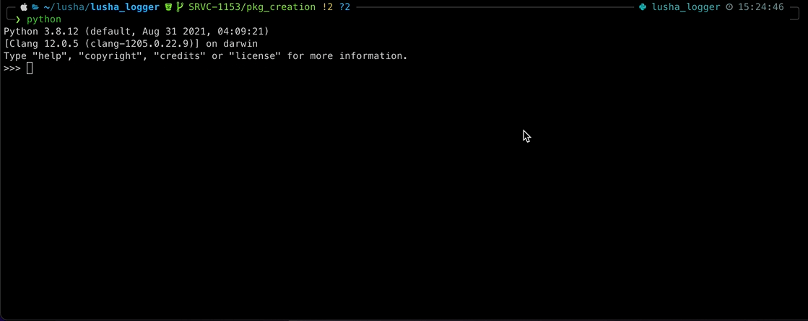

# logger


### logger is a library which aims to bring enjoyable logging in all of lusha software which uses python.


Did you ever feel confused about how logs are being configured looks and work with `DATADOG`<br/>
How many times' did you use `print()` in a simple code instead?...<br/>
logging is fundamental to every application and eases the process of debugging.<br/>
Using logger you have no excuse not to use logging from the start, For Much more pleasant and powerful logging
experience.<br/>

## 🚀 Features

- Support pretty local log format with predefined schema and colors.
- Support both `JSON` logs (for `DATADOG`) and `PLAIN TEXT` logs by config.
- Support `DATADOG` tags.
- Support dynamic const fields like `request_id`.
- Support multiple `Dict`s pretty print.
- Fast `Json` dumping using `orjson`.
- You can use any of [loguru](https://github.com/Delgan/loguru) features with this package.
- Building with [Jenkins Job](https://jenkins.lusha.co/job/Data%20Group/job/data_AmatsukamiLogger/)
- Support For `Python 3.8` and above.
- Support redirecting 3rd party packages loggers.
- Support for redirecting warnings messages displayed by `warnings.warn`

## Usage and Examples:

### Basic usage:

```
from AmatsukamiLogger import logger, initialize

initialize(enable_datadog=False, enable_stackprinter_stacktrace=True, log_level="DEBUG", service_name="ll_exmaple")

logger.debug("I`m debug")

with logger.contextualize(path="Music", request_id="07f33010-77a5-11ec-ac21-ae1d19e4fa20"):
    logger.info("I`m info with str extra field", contact_id="Noa Kirel")
    logger.warning("I`m warn with extra dict:", some_dict={"numbers": [4, 8, 3]})
```

#### Will print:

Unfortunately colors can't be seen in this markdown file.

```
|DEBUG| 2022-02-07 15:32:53:703 |68bfcee| dor.rokah-MacbookPro | ll_exmaple | main_example:7
I`m debug
|INFO| 2022-02-07 15:32:53:704 |68bfcee| dor.rokah-MacbookPro | ll_exmaple | main_example:10 | request_id:07f33010-77a5-11ec-ac21-ae1d19e4fa20 | contact_id:Noa Kirel | path:Music
I`m info with str extra field
|WARNING| 2022-02-07 15:32:53:704 |68bfcee| dor.rokah-MacbookPro | ll_exmaple | main_example:11 | request_id:07f33010-77a5-11ec-ac21-ae1d19e4fa20 | path:Music
I`m warn with extra dict:
{
  "some_dict": {
    "numbers": [
      4,
      8,
      3
    ]
  }
}
```

Any logs nested under:`logger.contextualize(path="Music", request_id="pouch")`<br/>
Will have the extra fields: `path="Music", request_id="pouch"`<br/>

Notice you can add any extra values that you want to the log.<br/>
If it is possible to inline the value in the first log line it will.<br/>
if not it will pretty print any enter type value in a new row after the message line.<br/>
You can view more examples below. <br/>

#### When `enable_datadog=True`:
```
{"timestamp":"2022-02-07 15:35:19.587305+02:00","message":"I`m debug","commit":"68bfcee","service_name":"ll_exmaple","hostname":"dor.rokah-MacbookPro","level":"DEBUG","dd.trace_id":"0","dd.span_id":"0","dd.env":"","dd.service":"","dd.version":""}
{"timestamp":"2022-02-07 15:35:19.587890+02:00","message":"I`m info with str extra field","commit":"68bfcee","service_name":"ll_exmaple","hostname":"dor.rokah-MacbookPro","level":"INFO","dd.trace_id":"0","dd.span_id":"0","dd.env":"","dd.service":"","dd.version":"","path":"Music","request_id":"07f33010-77a5-11ec-ac21-ae1d19e4fa20","contact_id":"Noa Kirel"}
{"timestamp":"2022-02-07 15:35:19.588085+02:00","message":"I`m warn with extra dict:","commit":"68bfcee","service_name":"ll_exmaple","hostname":"dor.rokah-MacbookPro","level":"WARNING","dd.trace_id":"0","dd.span_id":"0","dd.env":"","dd.service":"","dd.version":"","path":"Music","request_id":"07f33010-77a5-11ec-ac21-ae1d19e4fa20","some_dict":{"numbers":[4,8,3]}}
```

## The Log schema:

```
|LEVEL| YYYY-MM-DD HH:mm:ss:SSS |GIT_HASH| HOSTNAME | SERVICE_NAME | MODULE:LINE | INLINE_EXTRAS 
MESSAGE
EXTRAS
```

#### logger.exception(exception:Exception):

```
|LEVEL| YYYY-MM-DD HH:mm:ss:SSS |GIT_HASH| HOSTNAME | SERVICE_NAME | MODULE:LINE | INLINE_EXTRAS | EXCEPTION_TYPE
EXCEPTION_MESSAGE
STACKTRACE
EXTRAS
```

## Configuration:

`initialize` - Creates A logger config log handler and set loguru to use that handler.

```
enable_datadog : bool
  when enabled logs will be sent in json format, and datadog tags will be added,
  should be enabled when running in K8S.
  When using this option you must have a envirment varible named "COMMIT_HASH"
  which will be the first 7 charathers of the commit hash.
service_name : str,
  field which will be in every log (default is "unnamed_service")
enable_stackprinter_stacktrace : bool,
  a flag used to use stackprinter for in case of exception stacktrace can be more readable in some cases
  (default is False)
log_level : str,
        TRACE < DEBUG < INFO < SUCCESS < WARNING < ERROR, EXCEPTION < CRITICAL (default is INFO)
local_logs_extra_types : [type],
  list of logs fields types which will be added to the first line in the log if possible
  (default is [int, float, bool]) plus str which does not have \n in them and their length do not pass 40 chars
log_to_stdout : bool,
  flag used to enable logging to stdout (default is True)
log_file_name : str,
  flag used to enable logging to a file the value will be the file logs file name (default is None)
loguru_stdout_extras : dict,
  dict for extra args that can be pass down the logger.add() method of loguru only stdout compatible fields will work here.
  You can read more about this in loguru docs:
  https://loguru.readthedocs.io/en/stable/api/logger.html#loguru._logger.Logger.add
loguru_log_file_extras : dict,
  dict for extra args that can be pass down the logger.add() method of loguru only file log compatible fields will work here.
  You can read more about this in loguru docs:
  https://loguru.readthedocs.io/en/stable/api/logger.html#loguru._logger.Logger.add
redirect_3rd_party_loggers : bool,
  flag used to redirect all loggers handlers that being used to loguru logger (default is False)
suppress_standard_logging : dict{logger_name[str]: log_level[int]},
  list of loggers by their names which will be set to the desired log level (default is None)
```

# More Examples:

### Errors and custom types printing:

```
initialize(log_to_stdout=True,
           log_file_name="my_logs.log",
           enable_datadog=False,
           service_name="ll_exmaple",
           enable_stackprinter_stacktrace=True,
           local_logs_extra_types={'rotation': "1 MB"})

logger.error("I`m error")
logger.critical("I`m critical")
logger.warning("This is a log with list and simple type:", is_exmaple=True, some_list=["a", "b", "c"])
```

#### Will print (will also be written to a file called "my_logs.log"):

```
|ERROR| 2022-02-07 15:41:41:296 |68bfcee| dor.rokah-MacbookPro | ll_exmaple | main_example:21
I`m error
|CRITICAL| 2022-02-07 15:41:41:297 |68bfcee| dor.rokah-MacbookPro | ll_exmaple | main_example:22
I`m critical
|WARNING| 2022-02-07 15:41:41:297 |68bfcee| dor.rokah-MacbookPro | ll_exmaple | main_example:23
This is a log with list and simple type:
{
  "is_exmaple": true,
  "some_list": [
    "a",
    "b",
    "c"
  ]
}

```

#### Exception:

```
try:
    raise Exception("Some Exception")
except Exception as exc:
    logger.exception(exc)
```

#### Will print:

```
|EXCEPTION| 2022-02-07 15:41:41:298 |68bfcee| dor.rokah-MacbookPro | ll_exmaple | main_example:28 | Exception
Some Exception:
File "/Users/dor.rokah/lusha/AmatsukamiLogger/main_example.py", line 26, in <module>
    22   logger.critical("I`m critical")
    23   logger.warning("This is a log with list and simple type:", is_exmaple=True, some_list=["a", "b", "c"])
    24   
    25   try:
--> 26       raise Exception("Some Exception")
    27   except Exception as exc:
    ..................................................
     logger.critical = <method 'Logger.critical' of <loguru.logger handlers=[(id=3,
                         level=20, sink=<stderr>), (id=4, level=20, sink='my_logs.lo
                        g')]> _logger.py:1985>
     logger.warning = <method 'Logger.warning' of <loguru.logger handlers=[(id=3, 
                       level=20, sink=<stderr>), (id=4, level=20, sink='my_logs.log
                       ')]> _logger.py:1977>
     exc = Exception('Some Exception')
    ..................................................


```

#### Exception with multiple extra fields:

```
try:
    raise Exception("Exception with multiple fields")
except Exception as exc2:
    logger.exception(str(exc2),
                     # You can throw any extra field you wany here it will pretty print them in local run and add them to json log when (enable_datadog=True)
                     request_id="another_request",
                     pokemon_id="Pikachu",
                     person_id="23132161891161515616116516515615157615785",  # this is longer then 40 chars and thats why this log will not be in the first row of the log
                     dict1={"numbers": [4, 8, 3]},
                     dict2={"strings": "Hello"})
```

#### Will print:

```
|EXCEPTION| 2022-02-07 15:41:41:473 |68bfcee| dor.rokah-MacbookPro | ll_exmaple | main_example:33 | request_id:another_request | pokemon_id:Pikachu | Exception
Exception with multiple fields:
File "/Users/dor.rokah/lusha/AmatsukamiLogger/main_example.py", line 31, in <module>
    27   except Exception as exc:
    28       logger.exception(exc)
    29   
    30   try:
--> 31       raise Exception("Exception with multiple fields")
    32   except Exception as exc2:
    ..................................................
     logger.exception = <method 'Logger.exception' of <loguru.logger handlers=[(id=3
                         , level=20, sink=<stderr>), (id=4, level=20, sink='my_logs.l
                         og')]> _logger.py:1989>
     exc2 = Exception('Exception with multiple fields')
    ..................................................

Exception: Exception with multiple fields{
  "person_id": "23132161891161515616116516515615157615785",
  "dict1": {
    "numbers": [
      4,
      8,
      3
    ]
  },
  "dict2": {
    "strings": "Hello"
  }
}

```

#### @logger.catch :

```
@logger.catch
def logger_catch_decorator_example(x, y, z):
    # An error? It's caught anyway!
    return 1 / (x + y + z)


logger_catch_decorator_example(0, 0, 0)

```

#### Will print:

```
|EXCEPTION| 2022-02-07 15:41:41:494 |68bfcee| dor.rokah-MacbookPro | ll_exmaple | main_example:47 | ZeroDivisionError
division by zero:
File "/Users/dor.rokah/lusha/AmatsukamiLogger/.venv/lib/python3.8/site-packages/loguru/_logger.py", line 1220, in catch_wrapper
    1218  def catch_wrapper(*args, **kwargs):
    1219      with catcher:
--> 1220          return function(*args, **kwargs)
    1221      return default
    ..................................................
     args = (0, 0, 0, )
     kwargs = {}
     catcher = <loguru._logger.Logger.catch.<locals>.Catcher object at 0x11
                05545e0>
     function = <function 'logger_catch_decorator_example' main_example.py:4
                 1>
     default = None
    ..................................................

File "/Users/dor.rokah/lusha/AmatsukamiLogger/main_example.py", line 44, in logger_catch_decorator_example
    41   @logger.catch
    42   def logger_catch_decorator_example(x, y, z):
    43       # An error? It's caught anyway!
--> 44       return 1 / (x + y + z)
    ..................................................
     logger.catch = <method 'Logger.catch' of <loguru.logger handlers=[(id=3, le
                     vel=20, sink=<stderr>), (id=4, level=20, sink='my_logs.log')
                     ]> _logger.py:1077>
     x = 0
     y = 0
     z = 0
    ..................................................

ZeroDivisionError: division by zero

```

### Notes:
 * logs in `DataDog` at level `SUCCESS` will shop up as `INFO` in `DataDog`.
 * logs in `DataDog` at level `TRACE` will not show up in `DataDog`.